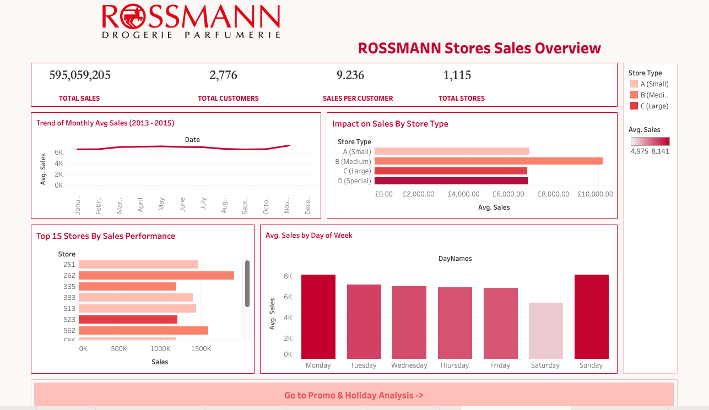
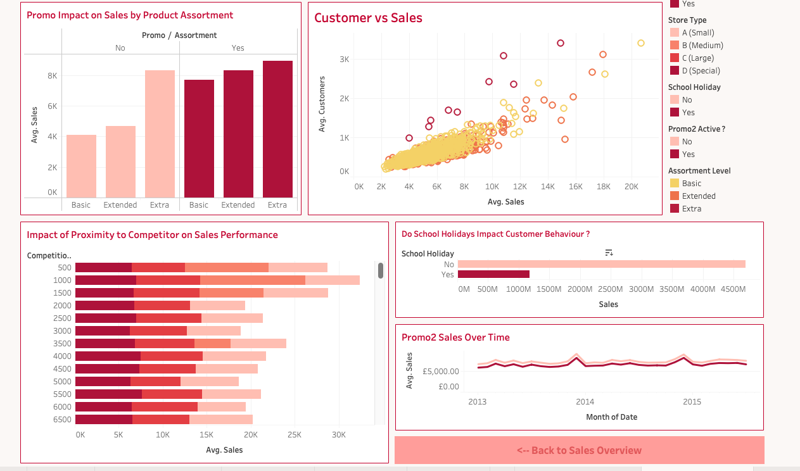

# 🏬 Rossmann Store Sales Analysis (Tableau Project)

This Tableau project provides a visual deep-dive into sales performance across Rossmann’s store network. Using a cleaned dataset, it explores high-level KPIs, sales trends, and external business drivers like promotions, holidays, and store competition.

---

## 📊 Dashboards Included

### 1️⃣ Rossmann Overview Dashboard

> An executive-level summary that includes:

- 💰 **Total Sales**, 👥 **Customers**, 📊 **Avg Sales/Customer**, 🏪 **Total Stores**
- 📈 Monthly Sales Trends with Moving Average
- 🥇 Top Performing Stores
- 🏷️ Sales Performance by Store Type

📷 **Preview:**  


---

### 2️⃣ Factors Driving Sales Performance

> A deeper look into external influences affecting store sales:

- 🎁 Promo vs Non-Promo Sales Impact
- 🧩 Sales by Assortment Strategy
- 👥 Correlation Between Customer Count and Sales
- 📅 Impact of State & School Holidays
- 🔁 Promo2 Effectiveness
- 📍 Competition Distance Influence

📷 **Preview:**  


---
### 🌐 View the Interactive Tableau Project  
🔗 [Rossmann Store Sales Dashboard on Tableau Public](https://public.tableau.com/views/Rossmann_Stores_Sales_Analysis/RossmanStoresSalesOverview)


## 📁 Project Structure

```plaintext
rossmann-tableau-dashboard/
│
├── Tableau Dashboards/
│   └── rossmann_sales_analysis.twbx
│
├── Data/
│   ├── rossmann_combined_clean.csv
│   └── original_sources.txt
│
├── Images/
│   ├── overview_dashboard.png
│   ├── factors_dashboard.png
│   ├── kpi_closeup.png
│   └── weekly_sales_trend.png
│
├── README.md
└── LICENSE


---

## 📥 Data Source

- [Kaggle: Rossmann Store Sales](https://www.kaggle.com/competitions/rossmann-store-sales)
cleaned and stored in Data folder as Rossmann_Sales_Data.csv

---

## 👨‍💻 Author

**Abdullah Shahzad**  
📧 Email: [abdullahshahzadhunjra@gmail.com](mailto:abdullahshahzadhunjra@gmail.com)  
🔗 GitHub: [github.com/abdullahhunjra](https://github.com/abdullahhunjra)  
🔗 LinkedIn: [linkedin.com/in/abdullahhunjra](https://linkedin.com/in/abdullahhunjra)

---

## 📄 License

This project is licensed under the [MIT License](LICENSE).
